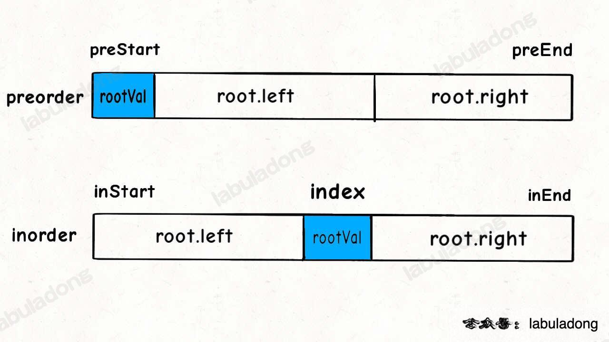

[recursion](https://blog.csdn.net/storyfull/article/details/102671946)
recursion都可以用stack解决；都是先解决后进入的问题
切记：对tree用stack的时候，要先右后左，反着来

+ 二叉树问题==只有两类==: 
  + 要么是采集，递归函数返回数值
  + 要么是构造，递归函数返回根节点
+ 二叉搜索树，只记住一句话：==中序遍历是从小到大==
+ 前中后序的深刻理解，要记住印度人的[描边大法](https://www.youtube.com/watch?v=WLvU5EQVZqY)
# 知识点
+ 二叉搜索树的定义：任何节点，他的左边都小于他，他的右边都大于他
1. full binary tree vs complete binary tree
    完全二叉树就是**只缺右下角**，（最后一层左边都满，其他层都满）
2. 二叉树VS二叉**搜索**树
   二叉搜索树有数值，且满足二分法关系(可以用来搜索)
3. 二叉树主要有两种遍历方式：
 + 深度优先遍历
   + 前序遍历（递归法，迭代法）
   + 中序遍历（递归法，迭代法）
   + 后序遍历（递归法，迭代法）
这里前中后，其实指的就是==中间节点的遍历顺序==
 + 广度优先遍历
   + 层次遍历（迭代法）
4. 所谓的前中后序遍历，其实是前中后序采集，遍历顺序都是一样的，区别只在于什么时候采集的数据

# 题目
## 遍历二叉树
 + 二叉树：226.翻转二叉树
<pre>
if node:
    <mark>node.left, node.right = node.right, node.left</mark>
    self.traverse(node.left)
    self.traverse(node.right)
    return node
</pre>
<pre>
<b>这里对children做遍历就不行了</b>
def backtrack(self, root):
    if not root:
        return None
    else:
        root.left, root.right = root.right, root.left
        for child in [root.left, root.right]:
            self.backtrack(child)
        return node
</pre>
 + ==二叉树：101.对称二叉树==**嗷嗷经典**
<pre>
def backtrack(self, left, right):
    if left == None and right != None:
        return False
    elif left != None and right == None:
        return False
    elif left == None and right == None: 
        return True
    elif left.val != right.val: 
        return False
    else:
        for i in [[left.left, right.right],[left.right, right.left]]: 
        <mark>这里遍历的到底是谁, 不是全层, 而是此层的一个基本单元内的所有可能值</mark>
            if self.backtrack(*i) == False:
                return False
                <mark>遇到一个就返回</mark>
        return True
        <mark>每层递归都要对应一个 return</mark>
 </pre>
+ 二叉树：222.完全二叉树的节点个数
  + 遍历思想
<pre>
def backtrack(self, children):
    if not children[0] and not children[1]:
    <mark>这里的终止条件的判断，如果遍历的是children，如果遍历的是root</mark>
        return
    for child in children:
        if child:
            self.c += 1
            self.backtrack([child.left, child.right])
</pre>
  + 分解问题思想
<pre>
<b>这里的子问题是一个node尖所代表的三角形中，有多少nodes</b>
def getNodesNum(self, cur):
    if not cur:
        return 0
    <b>递归终止条件还是一如既往</b>
    c2 = 0
    for child in [cur.left, cur.right]:
        c1 = self.getNodesNum(child)
        c2 += c1
    return c2 + 1 
    <b>这里加1加的是那个尖尖</b>
</pre>
 + 二叉树：110.平衡二叉树
<b>做十遍！</b>
<b>做十遍！</b>
<b>做十遍！</b>

<pre>
def get_height(self, node: TreeNode) -> int:
    if not node:
        return 0
    h_left = self.backtrack(node.left)
    h_right = self.backtrack(node.right)
    if abs(h_left - h_right) > 1:
        return -1
    <b>这里对返回值进行了判断</b>
    if h_left == -1:
        return -1
    if h_right == -1:
        return -1
    return max(h_left, h_right) + 1
    <b>如何计算高度</b>
    <b>如果递归函数需要有返回值，应该怎么办</b>
    <mark>大亮点：这个返回值整合了两个含义。一是高度，二是是否平衡(-1)</mark>
</pre>
 + 二叉树：257.二叉树的所有路径(后序)
   + 二叉树写法
```python
if node:
    self.path.append(node.val)
    self.traverse(node.left)
    self.traverse(node.right)
    if not node.left and not node.right:
        self.res.append(self.path[:])
    self.path.pop()
```
   + n叉树写法：对children进行遍历
<pre>
def binaryTreePaths(self, root):
    self.traverse(<b>[root]</b>)
    <mark>此处切记变list，不然无法 for 循环</mark>
    return res_sorted
def backtrack(self, children):
    if not children[0] and not children[-1]:
        self.res.append(self.path[:])
    for child in children:
        if child:
        <b>必须对child的存在进行判断，因为要用到.val，相当于剪枝</b>
            self.path.append(child.val)
            self.backtrack([child.left, child.right])
            self.path.pop()
</pre>
   + n叉树写法：对node进行遍历 (这种写法无法遍历root，因为上来就进入left/right了)
<pre>
def traverse(self, node):
    if not node.left and not node.right:
    <b>终止条件语句稍有不同</b>
        self.res.append(self.path[:])
    for child in [node.left, node.right]:
        if child:
            self.path.append(child.val)
            self.traverse(child)
            self.path.pop()
</pre>
 + 二叉树：404.左叶子之和
```python
if node:
    if node.left and not node.left.left and not node.left.right:
        self.res += node.left.val
    self.traverse(node.left)
    self.traverse(node.right)
```
<pre>
def traverse(self, children):
    if not children[0] and not children[1]:
        return
    for child in children:
        if child:
        <mark>防止单边情况</mark>
            self.traverse([child.left, child.right])
            <mark>if child.left and not child.left.left and not child.left.right:
                self.res += child.left.val</mark>
            <b>这是个经典</b>
</pre>
 + 二叉树：513.找树左下角的值
  **显然无脑层序**
 + 二叉树：112.路径总和
  ==非常典型，联系其回溯框架，大通==
<pre>
def hasPathSum(self, root, targetsum: int) -> bool:
    if not root:
        return False
    <mark>上来就是判断root为空</mark>
    if self.backtrack([root], targetsum):
        return True

def backtrack(self, children, target):
    if not children[0] and not children[-1]:
        if self.res == target:
            return True
        return False
        <mark>这里要返回False不能返回空</mark>
    else:
        for child in children:
            if child:
            <mark>此处还是要先判断</mark>
                self.res += child.val
                if self.backtrack([child.left, child.right], target):
                    return True
                <mark>遇到就返回的应用</mark>
                self.res -= child.val
</pre>
**另外一种方法，对root进行遍历**
<pre>
def hasPathSum(self, root, targetSum):
    if not root:
        return False
    return self.backtrack(root, targetSum - root.val)

def backtrack(self, root, targetSum):
    if not root.left and not root.right: 
        if targetSum == 0:
            return True
        else:
            return False

    for child in [root.left, root.right]:
        if child:
            targetSum -= child.val
            if self.backtrack(child, targetSum):
                return True
            targetSum += child.val
</pre>
## 构造二叉树
<mark>一句话秘籍，抓住根结点，他的左右子树就是递归返回回来的根结点</mark>
+ 654 题「 最大二叉树」
  简单，找到最大值，两侧的就是左右子树的节点值
<pre>
if nums:
    node = TreeNode()
    node.val = max(nums)
    <b>idx = nums.index(node.val)</b>
    <mark>怎么取最大值的index</mark>
    node.left = self.constructMaximumBinaryTree(nums[:idx])
    node.right = self.constructMaximumBinaryTree(nums[idx+1:])
    return node
</pre>
+ 105 题「 从前序和中序遍历序列构造二叉树」
要从数组找到三个关键元素，根结点，左侧节点值，右侧节点值
其实每次分割之后左右两段刚好重复上一次的分割逻辑，具体见下图

<pre>
def buildTree(self, preorder, inorder):
    if preorder:
        root = TreeNode()
        root.val = preorder[0]
        idx = inorder.index(root.val)
        root.left = self.buildTree(preorder[1:idx+1], inorder[0:idx])
        root.right = self.buildTree(preorder[idx+1:], inorder[idx+1:])
        return root
</pre>
+ 106 题「 从后序和中序遍历序列构造二叉树」
+ 889 题「 根据前序和后序遍历构造二叉树」
+ 二叉树：617.合并两个二叉树
<mark>这道题非常具有启发意义，可以说囊括了二叉树，回溯所涉及的所有框架知识点</mark>
<mark>看十遍！</mark>
<mark>看十遍！</mark>
<mark>看十遍！</mark>
<pre>
def traverse(self, root1, root2):
    if not root1 and not root2:
        return 
    elif not root1:
        return root2
    elif not root2:
        return root1
    <mark>1) 这里的 if ... return 是触底反弹的意思，理解成层数就狭隘了</mark>
    else:
    <mark>2) 这个 else 非常有意思。注意跟回溯算法 for 循环那里对比，其实回溯 for 循环就是省略了 这个 else 而已</mark>
        root1.val = root1.val + root2.val

        root1.left = self.traverse(root1.left, root2.left)
        root1.right = self.traverse(root1.right, root2.right)
        <mark>3) 这里是有返回值的，思考什么时候需要有返回值什么时候不需要，我傻逼居然忘了返回值</mark>
        return root1
        <mark>4) 这个 return 就更有意思了，他其实是 else 这个逻辑里面的 return </mark>
</pre>
## 二叉搜索树
二叉树：700.二叉搜索树登场！
<pre>
def searchBST(self, root, val):
    if not root:
        return 
    elif root.val == val:
        return root
    else:
        if root.val > val:
            res = self.searchBST(root.left, val)
        else:
            res = self.searchBST(root.right, val)
        if res:
            return res
            <mark>遇到就返回</mark>
</pre>
二叉树：98.验证二叉搜索树
**完全不懂**
**完全不懂**
**完全不懂**
二叉树：530.搜索树的最小绝对差
二叉树：501.二叉搜索树中的众数
二叉树：236.公共祖先问题
二叉树：235.搜索树的最近公共祖先
二叉树：701.搜索树中的插入操作
二叉树：450.搜索树中的删除操作
二叉树：669.修剪二叉搜索树
二叉树：108.将有序数组转换为二叉搜索树
二叉树：538.把二叉搜索树转换为累加树
# 层序遍历
1. 维护队列，**出一进二**
   <pre>
    <mark>if not root:
        return 0</mark>
    que = [root]
    depth = 0
    <mark>while que:</mark>
        for _ in range(len(que)):
            <mark>node = que.pop(0)</mark>
            if node.left:
                que.append(node.left)
            if node.right:
                que.append(node.right)
    </pre>
2. 只要会层序遍历模版，题目都是**简单修改**(两三行)
3. 题目
 + 102.二叉树的层序遍历
 + 107.二叉树的层次遍历II
 + 199.二叉树的右视图
 + 637.二叉树的层平均值
 + 429.N叉树的层序遍历
 + 515.在每个树行中找最大值
 + 116.填充每个节点的下一个右侧节点指针
 + 117.填充每个节点的下一个右侧节点指针II
 + 104.二叉树的最大深度
 + 111.二叉树的最小深度

# 二叉搜索树
node.val具有一些性质的二叉树

